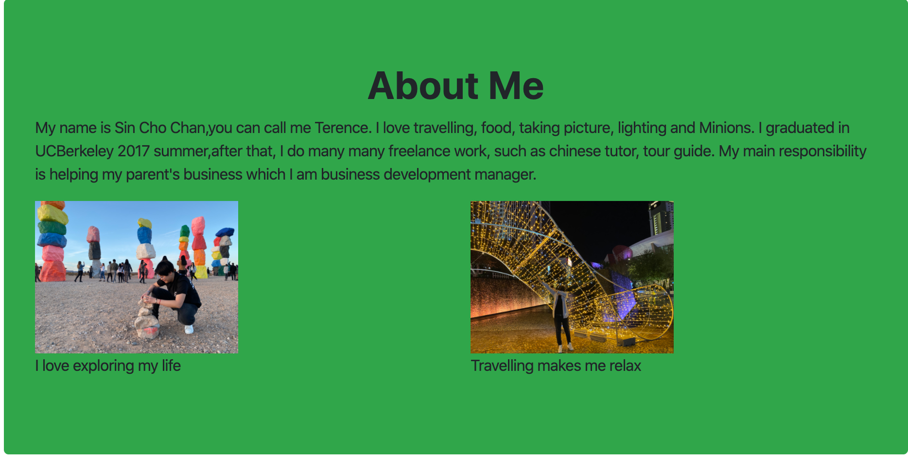
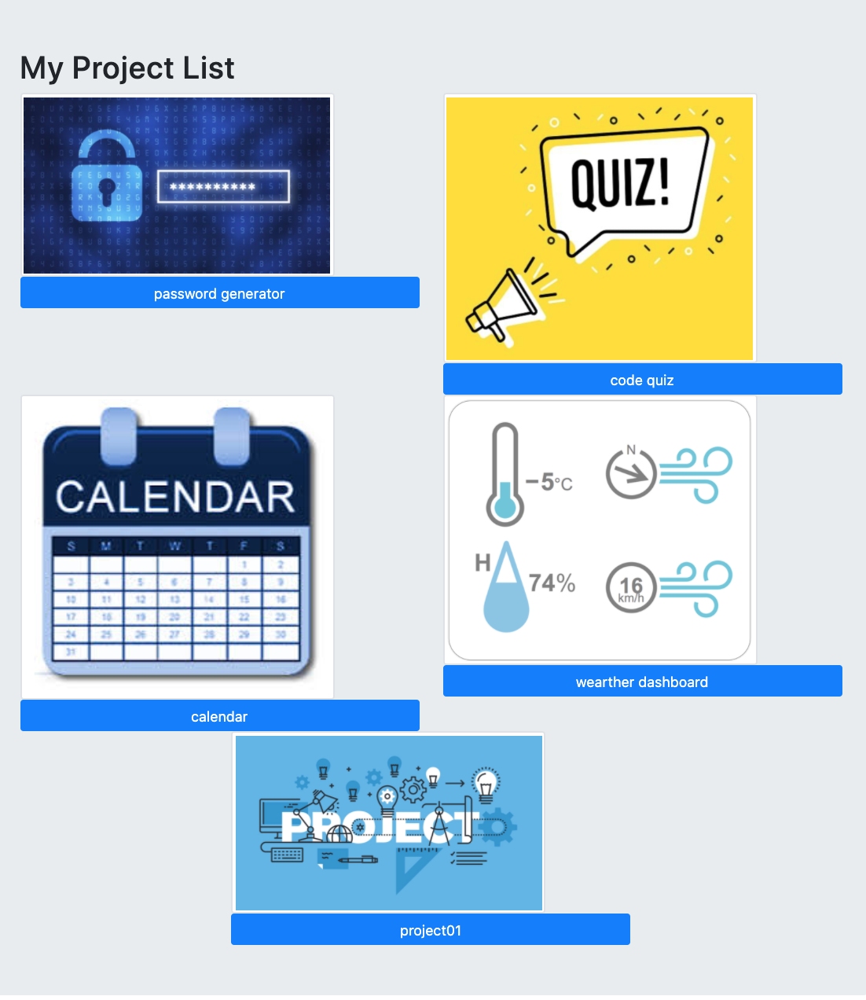

# Project Title

SIN CHO CHAN : Updated Portfolio Website 

## Location of URLs

This is the link to the github repo:

This is the link to the live website:

### Description

-There are 3 links to 3 different websites which is A contact me, portfolio and an About me page.

- the Portfolio Page shows 5 projects

### libraries

- HTML, CSS and the Bootstrap framework.

### Screenshot

